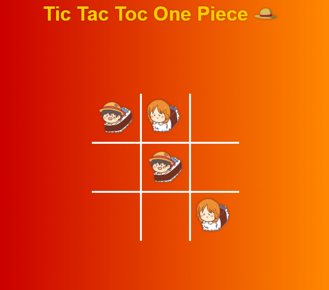

# Tic Tac Toe One Piece 🎩☠️

Um **Jogo da Velha** clássico com um toque épico de *One Piece*! Desafie um amigo para dominar o tabuleiro 3x3 e veja se você tem o que precisa para gritar "Luffy Venceu!" 🏴‍☠️

## ✨ Funcionalidades
- Tabuleiro interativo 3x3 com jogadas alternadas entre dois jogadores
- Mensagem de vitória ou empate com tema *One Piece* (ex.: "Luffy Venceu!")
- Botão para reiniciar partidas rapidamente
- Design estilizado com referências ao universo de *One Piece*
- Interface responsiva para jogar no desktop ou celular

## 🛠 Tecnologias
- **Frontend**: HTML5, CSS3, JavaScript
- **Estilização**: CSS personalizado
- **Recursos**: Imagens temáticas do universo de *One Piece*

## 🚀 Como Jogar
Acesse aqui: https://felipepaixaodn.github.io/tic-tac-toe-onepiece/

ou

1. Clone o repositório:
   ```bash
   git clone https://github.com/felipepaixaodn/tic-tac-toe-onepiece.git
2. Abra o arquivo index.html no navegador.
3. Escolha "Luffy" ou "Nami" e comece a aventura no tabuleiro!

## Créditos
Jogo com base no tutorial do Felipe Rocha.
https://www.youtube.com/watch?v=0EiX9c4vzRs


## 📸 Captura de Tela

